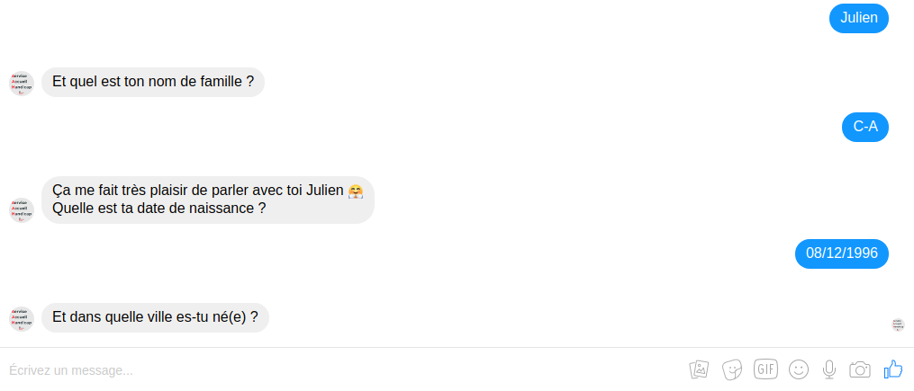

<h1 align="center">
   
  <b>Messenger Chatbot</b>
   
</h1>

<h4 align="center">An interactive Chatbot AI for user registration</h4>
<i><h5 align="center">4th year educational project</h5></i>

  
  
  

  <a href="#overview">Overview</a> •
  <a href="#report">Report</a> •
  <a href="#screenshots">Screenshots</a> •
  <a href="#license">License</a>

  

## **Overview**

This project was made during my *4th year* in engineering school.

The idea was to create a chatbot that would ease the registration process for the Handicap Reception Service of the Grenoble University. Indeed, some problems were encountered by the service and needed solutions:
- with a very limited reception surface, the service tended to get crowded
- the service provides information forms on their website that people can print and pre-fill before actually coming to the building, but a very small portion of students actually do it
Hence, by reducting the amount of people coming to the service and easing the pre-filling form process, the aim of this Chatbot is to solve both these issues.

It's currently available on the Facebook page of the **[SAH (Service Accueil Handicap)](https://www.facebook.com/SAHGrenoble/)**. The hosting is made thanks to [Glitch](https://glitch.com/) and the database used for the interactions is [MongoDB](https://www.mongodb.com/).

## **Report**

A detailed report is available [here](doc/report.pdf) (as well as [a small presentation](doc/presentation.pdf)).

For more information, please refer to [this link](https://air.imag.fr/index.php/Chatbot_pour_borne_d%27accueil_handicap#Ressources).

## **Screenshots**

Here is the **conversation scheme**. It represents all the interactions the bot is able to have and all the paths he can follow depending on the answers of the user. Green boxes refer to written answers (for example the name of the user) and red words correspond to answers already written but that must be chosen by the user by simply clicking on it:

  

This is how a conversation with the bot looks like in Messenger:

  

## **License**

© **[Julien Cordat-Auclair](https://github.com/jcordatauclair)**
